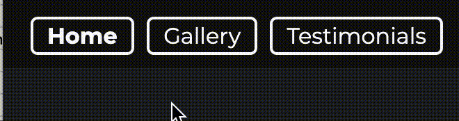

# William Cooke Photography Site

<!-- ABOUT THE PROJECT -->
## About The Project
This website was built for a hypothetical client interested in showcasing his studio photography work. His express wishes were for a clean professional looking site that is easy to navigate and puts huis work front and center. He also provided a short bio he wanted included on the site and wished for a contact form to be able to generate a list of potential clients. Finally he provided a list of previous customer's feedback to be added on a seperate page as a testimonials section.

In summary the site should contain these basic sections:

<ol>
  <li>Home / Landing page showcasing primary work</li>
  <li>About section with hero image to introduce the photographer</li>
  <li>Gallery Page to show primary selected work</li>
  <li>Testimonials page to show previous satisfied customers</li>
  <li>Contact page / form to allow contacting the photographer</li>
</ol>

### Built With
* [https://www.gitpod.io/](GitPod)

(<a href="#readme-top">back to top</a>)

<!-- GETTING STARTED -->
## Accessing the Site

The finished site is hosted with gitpages under:

 
<a href="https://a-hoenig.github.io/Project-One/">William Cooke Photography</a>

 

## CONTENTS

<!-- TABLE OF CONTENTS -->

  
Table of Contents

  <ol>
    <li>
      <a href="#about-the-project">About The Project</a>
      <ul>
        <li><a href="#built-with">Built With</a></li>
      </ul>
    </li>
    <li>
      <a href="#getting-started">Getting Started</a>
      <ul>
        <li><a href="#prerequisites">Prerequisites</a></li>
      </ul>
    </li>
    <li><a href="#usage">Usage</a></li>
    <li><a href="#roadmap">Roadmap</a></li>
    <li><a href="#contributing">Contributing</a></li>
    <li><a href="#license">License</a></li>
    <li><a href="#image-credits">Image Credits</a></li>
    <li><a href="#testing">Testing</a></li>
    <li><a href="#accessibility">Accessibility</a></li>
    <li><a href="#contact">Contact</a></li>
    <li><a href="#acknowledgments">Acknowledgments</a></li>
  </ol>

- - -

## User Experience (UX)

To ease navigation, standard practices were used to allow the visitor quick access to the site pages via a Navigation bar. 

In keeping with the 'mobile first' philosophy, on smaller screens the Navbar is consolidated into a 'menu burger icon' that presents a drop down view of the navigation bar when pressed.

Other elements such as the Photographers signature, teh contact button and copyright info are all dynamically sized to make full use of the available screen realestate.

hover events are utilized thoughout to give feedback to the user that they are interacting with a clickable button.
- - -

## Design

### Colour Scheme

The web interface was deliberately chosen with a monochrome dark grey and white look to offset the interface and provide a contrast to the pictures being presented.
Thte color #fafafa was used for text and button elements to reduce teh stark contrast of pure white on black.

### Typography

2 Fonts re used on the site for simplicity. 

<a href="https://fonts.google.com/specimen/Montserrat?query=montserrat">Montserrat</a> Used for all site text and headings.

<a href="https://fonts.google.com/specimen/Freehand?query=freehand">Freehand</a> used only for the Site Title and the photographers signature.

(<a href="#readme-top">back to top</a>)

### Wireframes

Wireframes were created for mobile, tablet and desktop using balsamiq.

(<a href="#readme-top">back to top</a>)

#### The Home Page

The home page serves as the landing page and aims to impress the visitor with a striking studio portrait image that fills tehe screen as much as possible on a minimal interface. The bold white text instantly informs the visitor what the ppurpose of the site is.

The navigation bar and footer are fixed to keep the minimal site controls always visible. 

A single white centered arrow invites the user to scroll down to view the next section - in this case the about summary of the photographer.

#### The About Section

The about section give a self portrait of the Photographer and his welcome text to invite you in and share his passion. The text dynamically adjusts around the circular photo on larger screens.

#### The Gallery Page

The gallery page is once again designed to put the pictures first. Only minimal margins are used to allow maximum content. Media queries dnamically adjust the numbe rof columns as more screensize becomes available. For phone displays only a single colum is used with each picture taking up the full width. On teh largest screen, 4 columns are used to fill the screen with images.

A simple white border is used as a mouse over effect to highlight a specific picture the user is interested in.

#### The Testimonials Page

THis page uses a marquee effect of vertically scrolling text to showcase previous customers feedback. The text is scolled in a simple transparent frame that dynamically resizes for screen realestate.

#### The Contact Page

The contact form invites the user to fill in their details and select what type of possible photoshoot they might be interested in. The form dynamically resizes to teh left on larger screens to keep the interface manageable. The same background is used as throughout the site.

#### Future Implementations

Future developement of the site would include:

1. Clickable images in the gallery to present a photo on full screen.
2. Fullscreen display would then add left and right arrows to allow the user to step through the images
3. Dynamic effects and display of the pop up menu should be animated to make the transition less abrupt and convey a further sense of prefessionalism

### Accessibility

I have been mindful during coding to ensure that the website is as accessible friendly as possible. This has been have achieved by:

* Using semantic HTML.
* Using a hover state on all buttons on the site to make it clear to the user if they are hovering over a button.
* Choosing a sans serif font for the site - these fonts are suitable for people with dyslexia.
* Ensuring that there is a sufficient colour contrast throughout the site.
* Using detailed alt descriptions of all images and adding aria-labels for navigational elements where neccessary.

- - -

### Technologies Used

#### Languages:

HTML, CSS only.

* [Balsamiq](https://balsamiq.com/) - Used to create wireframes.

* [Git](https://git-scm.com/) - For version control.

* [Github](https://github.com/) - To save and store the files for the website.

* [GitPod](https://gitpod.io/) - IDE used to create the site.

* [GithubPages](https://pages.github.com/) - Hosts the deployed website

* [Google Fonts](https://fonts.google.com/) - To import the fonts used on the website.

* [Google Developer Tools](https://developers.google.com/web/tools) - To troubleshoot and test features, solve issues with responsiveness and styling.

* [Favicon.io](https://favicon.io/) To create favicon.

* [Am I Responsive?](http://ami.responsivedesign.is/) To show the website image on a range of devices.

* [Webpage Spell-Check](https://chrome.google.com/webstore/detail/webpage-spell-check/mgdhaoimpabdhmacaclbbjddhngchjik/related) - a google chrome extension that allows you to spell check your webpage. Used to check the site and the readme for spelling errors.

* [ChatGPT](https://chat.openai.com/auth/login) - AI Large Language Model used to generate fake customer testimonials and photographer bio

* [FakeNameGenerator](https://www.fakenamegenerator.com/) - Generates random full profile of a fake person

* [MOV to GIF](https://cloudconvert.com/mov-to-gif) - to generate gifs from screen recordings

(<a href="#readme-top">back to top</a>)

- - -

## Deployment & Local Development

### Deployment

The site is deployed using GitHub Pages - [William Cooke Photography](https://a-hoenig.github.io/Project-One/index.html).

To Deploy the site using GitHub Pages:

1. Login (or signup) to Github.
2. Go to the repository for this project, [A-Hoenig/Project-One](https://github.com/A-Hoenig/Project-One).
3. Click the settings button.
4. Select pages in the left hand navigation menu.
5. From the source dropdown select main branch and press save.
6. The site has now been deployed, please note that this process may take a few minutes before the site goes live.

### Local Development

#### How to Fork

To fork the repository:

1. Log in (or sign up) to Github.
2. Go to the repository for this project, [A-Hoenig/Project-One](https://github.com/A-Hoenig/Project-One)
3. Click the Fork button in the top right corner.

#### How to Clone

To clone the repository:

1. Log in (or sign up) to GitHub.
2. Go to the repository for this project, [A-Hoenig/Project-One](https://github.com/A-Hoenig/Project-One)
3. Click on the code button, select whether you would like to clone with HTTPS, SSH or GitHub CLI and copy the link shown.
4. Open the terminal in your code editor and change the current working directory to the location you want to use for the cloned directory.
5. Type 'git clone' into the terminal and then paste the link you copied in step 3. Press enter.

(<a href="#readme-top">back to top</a>)

- - -

## Testing

### Validator Testing

#### HTML
  - No errors were returned when passing through the official [W3C validator](https://validator.w3.org/nu/?doc=https%3A%2F%2Fcode-institute-org.github.io%2Flove-running-2.0%2Findex.html)

#### CSS
  - No major errors were found when passing through the official [(Jigsaw) validator](https://jigsaw.w3.org/css-validator/validator?uri=https%3A%2F%2Fvalidator.w3.org%2Fnu%2F%3Fdoc%3Dhttps%253A%252F%252Fcode-institute-org.github.io%252Flove-running-2.0%252Findex.html&profile=css3svg&usermedium=all&warning=1&vextwarning=&lang=en#css)

### Accessibility

An accessibility score of 100 was achieved when anaylsing the site using Google Chrome Dev TGools Lighthouse.

The site was tested on three different browsers for functionality:

1. Chrome
2. Opera
3. Safari

### Known Bugs

* When viewing on screens that use touch rather than a cursor, the colour change for the answer button selected is not immediately obvious as the hover state remains on the button. If the user clicks away from the button the colour can then been seen.

  

* There is a a warning displaying in the console on the live page. This error seems to be because GitHub hosted pages disable googles 3rd party cookie alternative FLoC, which then throws this error. The error doesn't affect the site in any way.

  

* When friends tested the site they found that very rarely a game will get stuck on a question, and it will not populate a new question but the question no counter continues to increase. This issue only seems to be if a large number of games are played consecutively, possibly using up the questions in the API. I have not been able to replicate this issue to troubleshoot further.
  

- - -

## Credits

### Code Used

* I used [this You Tube tutorial](https://www.youtube.com/watch?v=XH5OW46yO8I) to learn how to create a modal for the how to play section.

* As the API I used for the questions declared the correct answer and then had an array of incorrect answers, I had to find a way to shuffle the answers together so that the correct answer wouldn't always appear on the same button. Research led me to the Fisher-Yates Shuffle. Other methods of shuffling can favour some items in the array more than others, however the Fisher Yates Shuffle allows for a more even spread of probability of the answer being placed on each button. I used the following [YouTube tutorial](https://www.youtube.com/watch?v=eATLMjs7y4s&list=PL5egNEXQTWmFHAoWFVRLNAvD-9zzyWVxA&index=3) to further adapt the shuffle I had researched on W3Schools to work with the data I had.

As the JavaScript modules of the Code Institute Diploma did not cover local storage, I had to do a bit of research into this topic myself in order to set up the high scores section of my site.

* I used this [video tutorial](https://www.youtube.com/watch?v=DFhmNLKwwGw&list=PLDlWc9AfQBfZIkdVaOQXi1tizJeNJipEx&index=9) on YouTube by [James Q Quick](https://www.youtube.com/channel/UC-T8W79DN6PBnzomelvqJYw) which taught me to save the team name and score to an object, that would then be saved into an array in local storage. It also explained how to sort the items in the array into descending score order, and then to splice the array, I have used the MAX_HIGH_SCORES as my point to splice.

* I used this [video tutorial](https://www.youtube.com/watch?v=jfOv18lCMmw&list=PLDlWc9AfQBfZIkdVaOQXi1tizJeNJipEx&index=10) on YouTube by [James Q Quick](https://www.youtube.com/channel/UC-T8W79DN6PBnzomelvqJYw) to learn how to insert the local storage into the high scores page.

### Content

All questions for my site were pulled from [The Open Trivia Database](https://opentdb.com/) using their API.

All other content for the site, such as introduction messages and instructions were written by myself.

### Media

[Page background image of a pub](https://pixabay.com/photos/bar-pub-cafe-establishment-stools-2209813/)

### Acknowledgments

I would like to acknowledge the following people:

* Adegbenga  Adeye - My Code Institute Mentor.

* Bim Williams - For being a great sounding board for me when I faced issues with moving onto the next question in the quiz, and for helping solve the issue faced with the HTML entity characters in the answer buttons.

* [Dave Horrocks](https://github.com/daveyjh) - For taking the time to walk through my code with me when I was struggling with adding event listeners.

* [Emanuel Silva](https://github.com/manni8436) - For cheering me on when I was struggling with the JavaScript, and for testing the site.

* [Abi Harrison](https://github.com/Abibubble) - For being a great rubber duck and helping debug, helping to test the site and for sharing her knowledge on accessibility.

* The Code Institute Slack channel Peer Code Review - Thank you to everyone who took the time to play the quiz and look over the code.